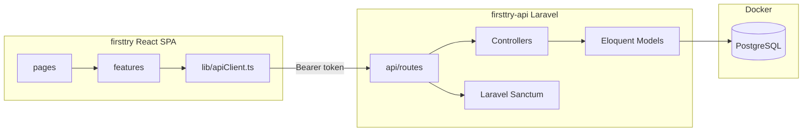

# Laravel API и локальный PostgreSQL

## Текущее состояние проекта

Фронтенд — React 19 + Vite 8 + TypeScript в [`/home/user/diploma/firsttry`](/home/user/diploma/firsttry).

| Слой | Сейчас | Файлы |
|------|--------|-------|
| Auth | Supabase Auth + mock (`VITE_USE_MOCK`) | [`src/features/auth/authApi.ts`](src/features/auth/authApi.ts), [`src/lib/supabase.ts`](src/lib/supabase.ts) |
| Events | Прямой `supabase.from('events').select(...)`, fallback на [`mockEvents`](src/features/events/mockEvents.ts) | [`src/features/events/eventsApi.ts`](src/features/events/eventsApi.ts) |
| Profile | `profiles` + `auth.getUser()` | [`src/features/profile/profileApi.ts`](src/features/profile/profileApi.ts) |
| Типы | `EventEntity`, `UserProfile`, `Participant` | [`src/types/domain.ts`](src/types/domain.ts) |
| Схема БД | Supabase SQL + RLS + `auth.users` | [`supabase/schema.sql`](supabase/schema.sql), [`supabase/seed.sql`](supabase/seed.sql) |

Backend `firsttry-api` **ещё не создан**. Зависимость `@supabase/supabase-js` присутствует в [`package.json`](package.json).

Окружение: Node 22 (см. [`.nvmrc`](.nvmrc)), `engines.node >= 20.19.0` в package.json.

---

## Целевая архитектура



Supabase полностью убирается: и Auth, и прямые запросы к таблицам. Папку [`supabase/`](supabase/) оставить как reference до завершения миграции, затем удалить.

---

## 1. Новый backend `firsttry-api`

Создать Laravel 11 проект **рядом** с фронтендом:

```
diploma/
  firsttry/          # существующий React
  firsttry-api/      # новый Laravel
```

Стек backend:
- **Laravel 11** + **Laravel Sanctum** (Bearer token auth)
- **PostgreSQL 16** в Docker
- Eloquent-модели вместо Supabase client

### Docker Compose (`firsttry-api/docker-compose.yml`)

- Сервис `postgres`: порт `5432`, БД `firsttry`, user/password из `.env`
- Laravel запускается **на хосте** (`php artisan serve`), подключается к контейнеру Postgres
- На Linux/WSL2: убедиться, что порт 5432 свободен

### Конфигурация Laravel

- `.env`: `DB_CONNECTION=pgsql`, хост `127.0.0.1`, порт `5432`
- `config/cors.php`: разрешить `http://localhost:5173` (Vite dev)
- Sanctum: middleware `auth:sanctum` на защищённых маршрутах

---

## 2. Схема БД (миграции Laravel)

Перенести логику из [`supabase/schema.sql`](supabase/schema.sql). Учесть миграции [`migrate_organizer_name.sql`](supabase/migrate_organizer_name.sql) и [`migrate_event_types.sql`](supabase/migrate_event_types.sql) — в Laravel-схеме эти поля/ограничения уже включены.

| Таблица | Изменения относительно Supabase |
|---------|----------------------------------|
| `users` | Стандартная Laravel + `full_name`, `position` (профиль в одной таблице; таблица `profiles` и `auth.users` не нужны) |
| `events` | UUID `id`; поля как в schema.sql; колонка `estimate` → в API отдавать как `estimateNote` |
| `participants` | UUID `id`, `full_name`, `specialization` |
| `event_participants` | pivot `event_id` + `participant_id` |
| `personal_access_tokens` | Sanctum (автоматически) |

Маппинг полей events (snake_case в БД → camelCase в JSON):

| БД | API / [`EventEntity`](src/types/domain.ts) |
|----|---------------------------------------------|
| `organizer_name` | `organizerName` |
| `participants_count` | `participantsCount` |
| `start_at` / `end_at` | `startAt` / `endAt` |
| `price_without_vat` / `price_with_vat` | `priceWithoutVat` / `priceWithVat` |
| `estimate` | `estimateNote` |
| `extra_services` (`text[]` → `json` в Laravel) | `extraServices` |
| `image_url` | `imageUrl` |

Типы событий: в БД хранить русские значения (`Конференция`, `Мастер-класс`, `Встреча`). В `EventResource` при необходимости нормализовать английские legacy-значения (как [`toEventType`](src/features/events/eventsApi.ts) на фронте сейчас).

Убрать RLS и триггеры Supabase — доступ контролируется **Laravel middleware**.

### Seeder

Портировать данные из [`supabase/seed.sql`](supabase/seed.sql) в `DatabaseSeeder`:
- 7 participants, 4 events, 9 связей `event_participants`
- Тестовый пользователь: `aruzhan@events.kz` / пароль для локальной разработки (например `password`)

---

## 3. REST API (контракт)

Все защищённые маршруты — `auth:sanctum`. Ответы в **camelCase** (API Resources), чтобы минимально менять фронт.

### Auth — `routes/api.php`

| Метод | Путь | Действие |
|-------|------|----------|
| POST | `/auth/register` | `{ email, password, fullName }` |
| POST | `/auth/login` | → `{ token, user: { id, email, fullName } }` |
| POST | `/auth/logout` | отзыв токена |
| GET | `/auth/me` | текущий пользователь |
| POST | `/auth/forgot-password` | заглушка для dev (без реальной почты) |
| PUT | `/auth/password` | `{ currentPassword, newPassword }` |

Контроллеры: `AuthController`, `PasswordController`.

### Events

| Метод | Путь | Действие |
|-------|------|----------|
| GET | `/events` | список с `participants`, сортировка `start_at DESC` |

`EventController@index` + `EventResource` — формат совпадает с [`EventEntity`](src/types/domain.ts).

### Profile

| Метод | Путь | Действие |
|-------|------|----------|
| GET | `/profile` | `{ fullName, email, position }` |
| PUT | `/profile` | обновление `fullName`, `position` (email read-only) |

---

## 4. Изменения во фронтенде `firsttry`

Страницы и маршруты **не меняются** — [`App.tsx`](src/App.tsx): `/current`, `/upcoming`, `/reports`, `/profile`, auth-страницы. Excel-выгрузка в [`exportReportsToExcel.ts`](src/features/reports/exportReportsToExcel.ts) работает с `EventEntity` локально.

### Новый HTTP-клиент

Создать [`src/lib/apiClient.ts`](src/lib/apiClient.ts):
- `VITE_API_URL` (например `http://localhost:8000/api`)
- хранение токена в `localStorage` (ключ, например `auth_token`)
- `Authorization: Bearer <token>` на защищённых запросах
- единая обработка ошибок (`throw new Error(message)`)

Обновить [`.env.example`](.env.example):
```
VITE_API_URL=http://localhost:8000/api
```
Удалить `VITE_SUPABASE_*`, `VITE_USE_MOCK`.

### Переписать API-слой

| Файл | Что меняется |
|------|----------------|
| [`src/features/auth/authApi.ts`](src/features/auth/authApi.ts) | HTTP вместо Supabase/mock; свой тип `AuthSession` вместо `Session` из supabase-js; убрать mock-логику (`MOCK_USERS_KEY`, `createMockSession`) |
| [`src/features/auth/AuthContextCore.ts`](src/features/auth/AuthContextCore.ts) | `session: AuthSession \| null` |
| [`src/features/auth/AuthContext.tsx`](src/features/auth/AuthContext.tsx) | импорт `AuthSession` вместо `Session` |
| [`src/features/events/eventsApi.ts`](src/features/events/eventsApi.ts) | `GET /events`; убрать Supabase select; fallback на [`mockEvents`](src/features/events/mockEvents.ts) только если `!VITE_API_URL` |
| [`src/features/profile/profileApi.ts`](src/features/profile/profileApi.ts) | `GET/PUT /profile`, `PUT /auth/password`; **изменить сигнатуру** `changeCurrentUserPassword(currentPassword, newPassword)` — сейчас принимает только `newPassword`, а [`ProfilePage`](src/pages/ProfilePage.tsx) уже собирает `currentPassword` в форме |

Удалить [`src/lib/supabase.ts`](src/lib/supabase.ts) и зависимость `@supabase/supabase-js` из [`package.json`](package.json).

### Dev-прокси (рекомендуется)

В [`vite.config.ts`](vite.config.ts) proxy `/api` → `http://localhost:8000`, тогда `VITE_API_URL=/api` в dev.

### Документация

Обновить [`README.md`](README.md):
- Backend: Docker Postgres, `composer install`, `php artisan migrate --seed`, `php artisan serve`
- Frontend: `nvm use` (Node 22), `npm install`, `npm run dev`
- На Linux: `npm install` выполнять локально (не копировать `node_modules` с Windows)

---

## 5. Что не входит в первый этап

- Реальная отправка email для сброса пароля (заглушка с понятным сообщением)
- CRUD мероприятий через API (фронт только читает события)
- Деплой в production
- Изменения UI/страниц beyond подключения к API

---

## 6. Порядок запуска после реализации

```bash
# Backend
cd /home/user/diploma/firsttry-api
docker compose up -d
composer install
cp .env.example .env && php artisan key:generate
php artisan migrate --seed
php artisan serve

# Frontend
cd /home/user/diploma/firsttry
nvm use
npm install
# .env: VITE_API_URL=http://localhost:8000/api
npm run dev
```

Проверка: вход → `/current`/`/upcoming`/`/reports` показывают 4 события из Postgres; профиль сохраняется; смена пароля с проверкой текущего; Excel-выгрузка работает как раньше.
